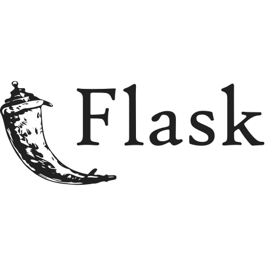

# Ollivanders with Docker
This Project belongs to @MateoGarciaG and @pau13-loop from Ollivanders Project. This Project is to practice Docker and DockerFile configuration to create a Container with gunicorn Server with Flask.


[](URL_Proyecto)

<!--Logos-->

<br>



<br>


<br>


## Tabla de Contenidos

1. [DockerFile Flask Ollivanders](#salidas-de-la-aplicacion)
1. [Tecnologías Usadas](#tecnologias-usadas)
1. [Reflexiones](#reflexiones)
1. [Licencia](#licencia)

---

## DockerFile Flask Ollivanders

```DockerFile
FROM python:3.8-slim-buster

COPY requirements.txt /
RUN pip3 install -r /requirements.txt

COPY . /app
WORKDIR /app

ENTRYPOINT ["./gunicorn.sh"]

```

``` Guni#!/bin/sh
#!/bin/sh
gunicorn --chdir app app:app -w 2 --threads 2 -b 0.0.0.0:80

```

### Run container Docker Ollivanders App
<br>


**[⬆ back to top](#tabla-de-contenidos)**


## Tecnologías Usadas

- Python 3
- Docker
- Visual Studio Code
- Git
- Flask


**[⬆ back to top](#tabla-de-contenidos)**


---

## Reflexiones
### Que has mejorado con este proyecto?
This project let me know how to create and managed to a DockerFile with Flask and Gunicorn server.


**[⬆ back to top](#tabla-de-contenidos)**


---


## Licencia

MIT License

Copyright (c) 2021 Mateo Garcia Gonzalez

Permission is hereby granted, free of charge, to any person obtaining a copy
of this software and associated documentation files (the "Software"), to deal
in the Software without restriction, including without limitation the rights
to use, copy, modify, merge, publish, distribute, sublicense, and/or sell
copies of the Software, and to permit persons to whom the Software is
furnished to do so, subject to the following conditions:

The above copyright notice and this permission notice shall be included in all
copies or substantial portions of the Software.


**[⬆ back to top](#tabla-de-contenidos)**

---


## Autor
Mateo Garcia Gonzalez